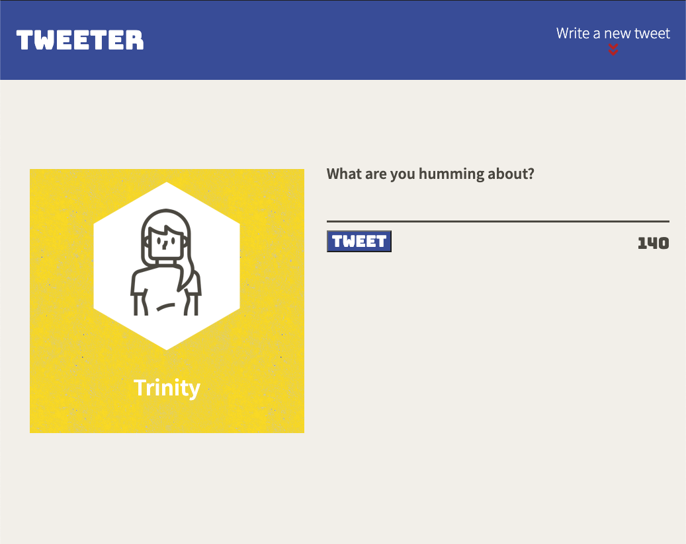

# Welcome to my Tweeter Project 

<div align="center">

</div>

# 
Tweeter is a simple, single-page app Twitter clone where you can post a 'tweet' and the page will update without going to a different page.
 
The project was focused more on Front End Development and a small percentage of Back End Development skills:
- HTML 
- CSS 
- Javascript 
  - JQuery
  - AJAX

## Final Product:

<p align="center">
  
</p>


## Dependencies needed

- [express](https://www.npmjs.com/package/express)
- [node 5.10.x or above](https://nodejs.dev/download/)
- [body-parser](https://www.npmjs.com/package/body-parser)
- [chance](https://www.npmjs.com/package/chance)
- [md5](https://www.npmjs.com/package/md5)
- [nodemon](https://www.npmjs.com/package/nodemon)

## Getting Started

1. Fork this repository, then clone your fork of this repository.
2. Install dependencies using the `npm install` command.

- sample (installing chance via *npmjs.com*):
``` 
npm install chance 
```

3. Start the web server using the `npm run local` command. The app will be served at <http://localhost:8080/>.
4. Go to <http://localhost:8080/> in your browser.



